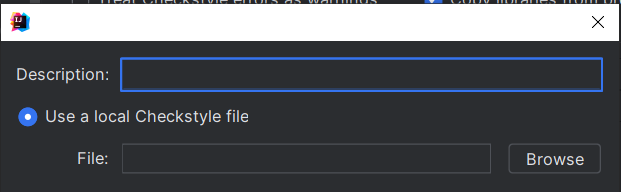

How to add the checkstyle to inteliji:
1. click top left hamburger menu
2. File --> Settings...
3. Code Styles --> click on the Gear icon next to Scheme
4. Click on import Scheme --> Checkstyle configuration
5. 
6. Navigate to checks.xml file

Credit:
© checks.xml to FHNW (SWC Module)

# Source Code Qualität Anforderungen

## Einführung

Dieses Dokument legt die Qualitätsanforderungen für den Quellcode der "Roomba in trouble" Java-Anwendung fest. Ziel ist es, sicherzustellen, dass der Code lesbar, wartbar, erweiterbar und fehlerfrei ist. Es enthält Richtlinien und Empfehlungen zu Code-Stil, Code-Kommentierung, Testabdeckung, Dokumentation, Wartbarkeit, Erweiterbarkeit, Performance und Sicherheit.

## Code-Stil

Der Quellcode muss in Übereinstimmung mit den folgenden Code-Stil-Konventionen geschrieben werden:

- Einheitliche Namensgebung von Variablen und Methoden: Verwenden Sie CamelCase für Variablen und Methoden, und PascalCase für Klassen.
- Anordnung von Importanweisungen: Gruppieren Sie Importanweisungen nach Paketen und sortieren Sie sie alphabetisch.
- Einheitliche Einrückung und Formatierung: Verwenden Sie 4 Leerzeichen für die Einrückung und platzieren Sie geschweifte Klammern auf einer neuen Zeile.
- Verwendung von sprechenden Variablennamen und Kommentaren zur Erklärung von komplexen Logikabschnitten.
- Verwendung von Leerzeichen zur Verbesserung der Lesbarkeit des Codes.

## Code-Kommentierung

Der Code muss ausreichend kommentiert werden, um seine Funktion und seinen Zweck zu erklären. Die Kommentare sollten die folgenden Aspekte abdecken:

- Erklärung der Funktion und des Zwecks von Variablen, Methoden und Klassen.
- Erklärung von komplexen Logikabschnitten.
- Dokumentation von Änderungen am Code, einschließlich Autor und Datum der Änderung.

## Code-Testabdeckung

- Handlich die wichtigsten Schnittstellen getestet

## Code-Dokumentation

Der Quellcode muss ausreichend dokumentiert werden, um seine Funktion und seinen Zweck zu erklären. Die Dokumentation sollte die folgenden Aspekte abdecken:

- Erklärung der Funktion und des Zwecks von Variablen, Methoden und Klassen.
- Erklärung von komplexen Logikabschnitten.
- Dokumentation von Änderungen am Code, einschließlich Autor und Datum der Änderung.

## Code-Wartbarkeit

Der Quellcode muss wartbar sein, um sicherzustellen, dass er leicht erweitert oder geändert werden kann. Dazu sollten folgende Maßnahmen ergriffen werden:

- Verwendung von sprechenden Variablennamen und Kommentaren zur Erklärung von komplexen Logikabschnitten.
- Verwendung von Leerzeichen zur Verbesserung der Lesbarkeit des Codes.
- Konsistente Einrückung und Formatierung des Codes.
- Verwendung von Kommentaren zur Dokumentation des Codes.
- Modularer und gut strukturierter Code, um Wartbarkeit und Verständlichkeit zu erleichtern.

## Code-Erweiterbarkeit

Der Quellcode muss erweiterbar sein, um sicherzustellen, dass er leicht um neue Funktionen erweitert werden kann. Dazu sollten folgende Maßnahmen ergriffen werden:

- Verwendung von sprechenden Variablennamen und Kommentaren zur Erklärung von komplexen Logikabschnitten.
- Verwendung von Leerzeichen zur Verbesserung der Lesbarkeit des Codes.
- Konsistente Einrückung und Formatierung des Codes.
- Verwendung von Kommentaren zur Dokumentation des Codes.
- Anwendung von Design-Patterns und Architekturprinzipien, die die Erweiterbarkeit unterstützen, wie z.B. MVC.

## Code-Performance

Der Quellcode muss gut performen, um sicherzustellen, dass das System reaktionsschnell und benutzerfreundlich ist. Dazu sollten folgende Maßnahmen ergriffen werden:

- Verwendung von effizienten Algorithmen und Datenstrukturen.
- Minimierung der Anzahl an teuren Operationen und Ressourcenverbrauch.
- Verwendung von Caching und Lazy-Loading, wo es angemessen ist.

## Fazit

Die Einhaltung dieser Anforderungen an die Source Code Qualität stellt sicher, dass der Quellcode der "Roomba in trouble" Java-Anwendung lesbar, wartbar, erweiterbar, fehlerfrei, performant und sicher ist. Die Beachtung dieser Best Practices hilft dabei, eine hohe Codequalität zu gewährleisten und das Risiko von Fehlern und Sicherheitslücken zu minimieren.
